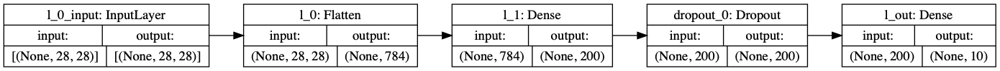

# Web-servers benchmark - machine learning service serving

Benchmarking webservers built using different languages and libraries

```yaml
python:
  - version: 3.7.4
  - libs:
    - aiohttp: 3.5.4
    - sanic: 19.6.3
    - tornado: 6.0.3
    - flask: 1.1.1
    - falcon: 2.0.0
    - werkzeug: 0.15.5
    - gunicorn: 19.9.0
go: 
  - version: 1.12.7
  - libs: 
    - net/nttp: 
nodejs:
  - version: 12.9.1
  - libs: 
    - express: ^4.17.1
r:
  - version: 3.6.1
  - libs:
    - plumber: 0.4.6
```

# Benchmarking tools

<a href="https://github.com/wg/wrk/" target="_blank">wrk</a>

## Hardware/Enviroment

Tests were performed on a GCP <em>g1-small</em> machine, configs:

```yaml
instance:
  - type: g1-small
  - os-image: debian-cloud/debian-9-stretch-v20190813
  - cpu: Intel(R) Xeon(R) CPU @ 2.00GHz
  - ram: 1.7G
```

## Dependency libraries

``` yaml
python:
  - tensorflow: 2.0.0b1
  - opencv-python: 4.1.0.25
  - numpy: 1.16.3
  
nodejs:
  - tensorflow: 1.2.8
  - multer: 1.4.2
  - sharp: 0.23.0
```

# Test

## ML "Hello World!" - <a hreg="https://en.wikipedia.org/wiki/MNIST_database" target="_blank">MNIST</a>, Handwritten Digits Recognition

## Model train

 Python version used:

```yaml
python:
  - version: 3.7.4
  - libs:
    - tensorflow: 2.0.0b1
```

## DNN Architecture

MNIST digits recognition model was trained using python with the neural network architecture similar to the one used in <a href="http://myselph.de/neuralNet.html" target="_blank">the project</a>:



See the <a hreg="https://www.tensorflow.org/beta/tutorials/keras/basic_classification" target="_blank">ternsorflow tutorial</a>, and [the code](mnist/dnn/train_run.py) for details. 

## API json contract

Test image:


The API response is expected as:

```json
{"data": {
    "digit": 2,
    "probability": 0.6915019751
    }
}
```

# Results

### Attention

<a href="https://github.com/wg/wrk/" target="_blank">wrk</a> doesn't support <em>POST</em> request with binary data body payload (i.e. image file). To be able to use wrk, the API web-servers are being converted to accept <em>GET</em> requests with the <u>test image used for the model input imported from the disk, not from request body</u>.

